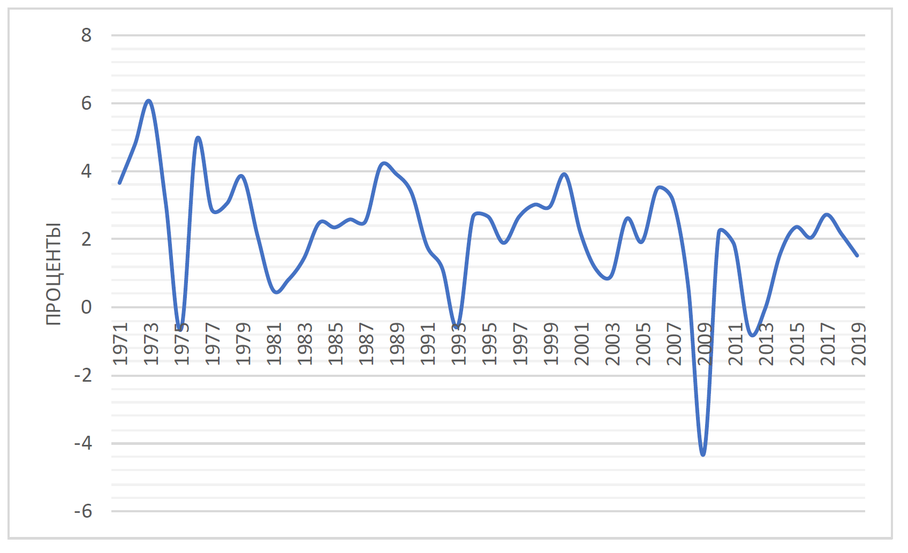

# Тезисы для «Деглобализации»

http://rabkor.ru/columns/analysis/2021/05/11/deglobalization-review/

К сожалению, я не успею *всё* рассказать.

Интересно также было бы рассмотреть критику работы (она в основном указывает на чрезмерную схематизацию процессов в работе и недосказанность важных вещей)

1. Взгляды экономистов во многом отражают действительность, но с опозданием ($\Rightarrow$ не наоборот)

2. *Марксизм: политэкономическое переосмысление международной торговли*?
   
    1. Показать на данных, как норма прибыли влияет на решение капиталистов
    2. Рассмотреть корреляцию ТУ и явлений в экономике
    3. 
    
3. Крушение биполярной системы, гегемония США

4. Противоречия глобализации в мир-системном анализе

5. Глобализация и де-||-  — отражение цикличности капитализма?

6. Противоречия неолиберальной глобализации 1980–2010, её этапы

    1. Сказать, что интересы ЕС и США — не одно и то же, заявления политиков и действия вооржённых сил, конечно же (ежу понятно), обусловлены не желанием «принести демократию», а экономическими интересами крупного бизнеса, пример: война вокруг «чёрной металлургии»
    2. Сейчас из-за кризиса глобализации повсеместно набирают популярность «национально ориентированные» партии и идеи. Кризис региональной интеграции. Говорят, что общее торговое пространство не даёт реализовывать независимую протекционистскую политику странам.
    3. 

7. Китай?
    1. Выход людей из бедности

    2. Ловушка модернизации, как он изначально развивался: «New Economic Policy» ориентирование

    3. Сейчас Китай — ЗА глобализацию, а страны «ядра» — против, против Китая вводят протекицонистские меры, Китайский проект One Belt one Road, глупо полагать, что Китаю нужна территория Сибири: пришлось бы много что делать с ней. Бизнесу нужно лишь использовать её как сырьевую базу, для чего не нужно присоединение этой территории.

        

    4. Китайский партийный деятель о том, что пришло время для экспроприации? НЭП кончается

    5. Игры с рынком — как игры с огнём

    6. Лоббизм Китая — в основном внешний

    7. Нельзя однобоко (one-sided) рассматривать политику Китая 
    
    8. Можно видеть 
