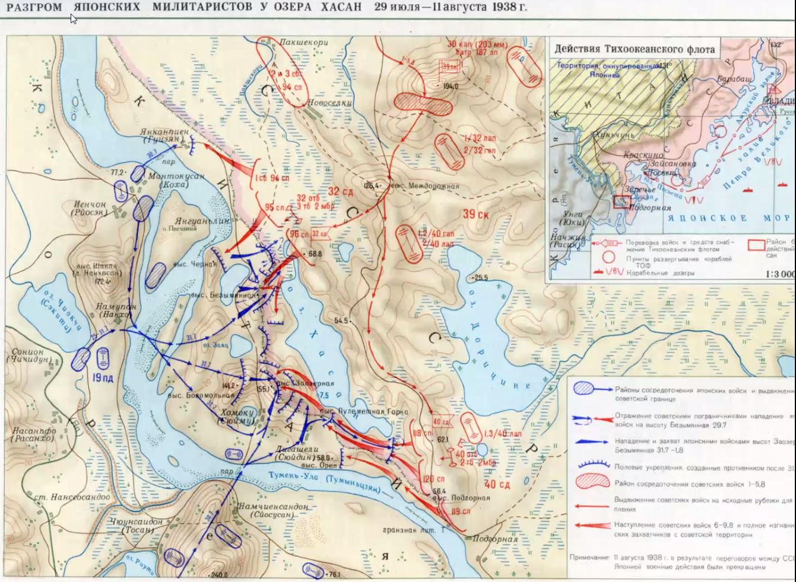

# Хасан и Халхингол

1937й год. Китай просит помощи у СССР против Японцев, захватывающих Маньчжурию.

Что Японцы делали у озера Хасан? СССР дал Китаю 

- 477 самолётов, 

- 82 танка, 

- 726 орудий, 

- 3825 пулемётов

- 700 автомашин

- Десятки вагонов боеприпасов

Ещё за 4 месяца количество поставленных боеприпасов и вооружения было удвоено.

То есть 

Дипломаты США хотели стравить СССР и страны Оси и говорили дипломатов СССР: запустите 

### Дипломатия + провокация на границе

1937 год: 69 провокаций

1938, до конфликта ≈ 100 провокаций

Командир на стороне СССР — Блюхер, его назвали немецкой фамилией, так как он был крестьянином, а помещик увлекался военной историей

Блюхер — хороший военачальник и политик, герой Гражданской войны.

Он так и служил с неё на дальнем востоке.

#### Генрих Люшков

Высокопоставленный человек в СССР, отвечал за охрану дальневосточных границ.

Он поехал туда, а потом магическим образом перешёл на сторону японцев, перенеся туда документы.

Один из самых крупных предателей СССР в войне.

$\Longrightarrow$ перетряхнули всю систему обороны границы, чтобы обесценить все сведения.

Напомним про «чистки» 1937-1938

### Боевые действия

Провокация: перешла большая дивизия, то есть человек ≈10'000

Захватили две высоты: «Заозёрная» и «Безымянная»

Японский дипломатический демарш: Потребовали вывести войска СССР с этих высот, так как они якобы находились на территории Японии.

Дипломаты СССР: показали карту, по которой это не так, какого-то ещё 18xx-какого-то года СССР не начнёт боевые действия, но не позволит вводить войска на свою территорию.

Туда были отправлены войска в ускоренном темпе.

Обычно так разговаривает сильный со слабым (как Япония с СССР, она/и хотела оценить шансф вести дальнейшую войну).

### Инцидент

Пехотная дивизия Японии (≈ 20'000 человек)

Начинаются какие-то нештатные ситуации с перемещением войск Японии.

Японцы выбивают 11 пограничников с высоты Безымянной.

С Советской стороны пришла рота подкрепления, выбила Японцев обратно.

На след. день генеральный штаб Японии сказал Корейской армии «действуйте по своему усмотрению»

Она выбила советских военнослужащих, прошли на 4 км, потом отступили.

Задача у них была лишь: захватить 3 высоты, а потом просто их оборонять.

Чтобы действия соответствовали их дипломатическим заявлениям, например, хорошо выглядеть перед США, Англией и т.д. .

Инцидент — не война, просто нота утверждения о том, что «я сильный».

Через 10 дней после начала: Японцы начали создавать укрепрайон.

В Москве вышло предложение «давайте начнём переговоры».

Ворошилов позвонил Блюхеру и сказал, что тут и так есть Штерн, и двум большим военачальникам тут (на дальнем востоке) нечего делать.

Даже мексиканцам после первой мировой войне было понятно, что 

Эшелоны — суть порождение многочисленных армий.

На Халхинголе реализовали тактику совместного наступления пехоты и танков.

Пехотинцы могут спрятаться за танки, а пехотинцы не дают вражеской пехоте кидать гранаты в танки.

$\Longrightarrow$ эффективно совместное наступление танков и пехоты

Обе высота были отбиты.

Посол Японии попросил о прекращении огня.

Потери со стороны японцев 526/15

В СССР: 859/2752

В таком соотношении потерь есть глубокий смысл.

ВС СССР и руководство Франции которое анализировало военные действия, были недовольны такими действиями, почему? Это вопрос.

Карта боевых действий у озера Хасан:

Обычно один обороняется, другой атакует, есть точка перехода.

Японцы создают эшелонированную оборону.

# Халхин-гол

Основные роды войск — пехота, авиация, артилерия и танки

Советские войска выступали с ещё не оккупированной Японией территории Китая, Японцы — с Маньчжурии

**Выступление Иннокентия**

Главный и вспомогательный удары

Главный обычно только один

Исключение — операция «Багратион» во время ВоВ. Был как раз расчёт на то, что немцы будут пытаться понять, какой главный, а какой 

### Логическая часть, анализ событий на Хасане

Как Французы, так и СССР анализировали войну

События этих немногих дней обнарцужили недочёты

Подготовка на недопустимо нихком уровне

Раздёрганы

Небоеспособны

Снабжение

Дороги, мосты, связь

Дальневосточный фронт

Говорят, плохая реакция со стороны 

***Французы***:

Господство, в том числе — в воздухе

Личный состав — окей

Командный состав — нет

Слабое место

Артилерия по картам

Массированные танковые атаки неподготовленны

Не были поддержаны

Не сумели договориться танки и пехота 

Неумелое командование

___

«Вася, прикрой» — слаженность

Если кто-то бросает гранату в танк, его товарищи должны отстреливать вражескую пехоту, препятствующую этому. 

Если речь идёт о лётчике, нужно прикрывать заднюю полусферу, так как 

Маневренность — умение переброситься в другое место.

Самый страшный человек для противника — корректировщик артогня, если он близко, артилерия 

Если танк проехал через окоп в «тыл», где штабы, артилерия, склалды…, то ему там «раздолье», но нужно зачистить окоп, так как иначе его тыл не прикрыт, там могут быть пехотинцы с гранатами

**Универсальный план по прочтению карты**

1. Заголовок: содержание и дата
2. Легенда, там меньше информации, чтобы сориентироваться
3. Хронологическое изложение

> Заметим, что масштаб на Хасане 1:80'000, с «Корейской» армией Японии
>
> Масштаб на Халхин-голе — 400'000, с «Квантунской» армией Японии
>
> Армии друг друга «подкалывали»

Одна из ключевых проблем сражения со стороны Красной Армии — танки на Юге были почти без поддержки пехоты. Жукова чуть под суд за это не отдали. Плюс странно, что артиллерия на Востоке была не за рекой, а перед ней, со стороны Японских частей.

