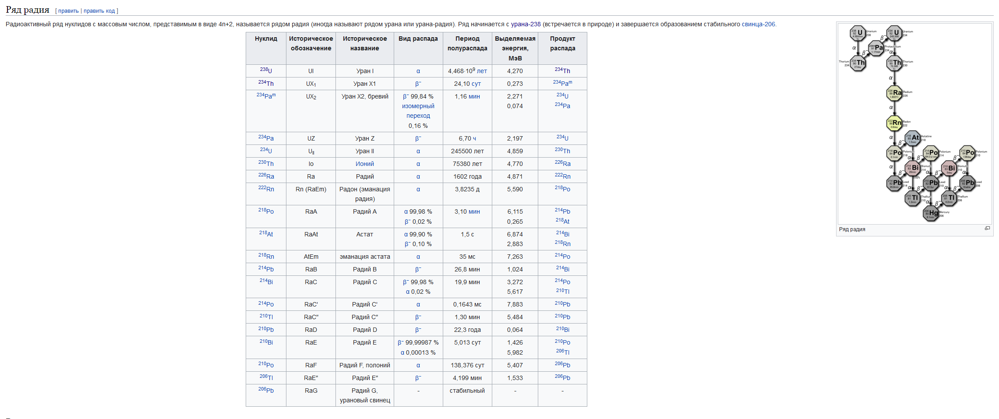
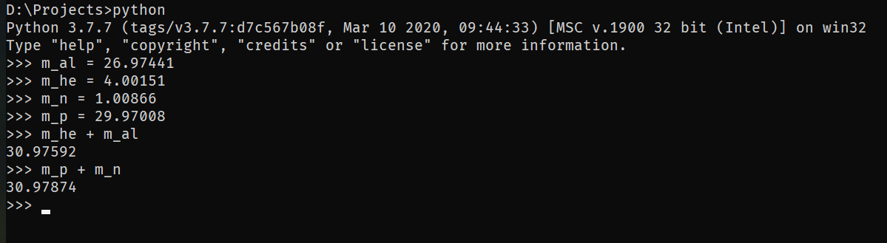

# Домашнее задание 41. Ядерные реакции.

# №1

> Запишите ядерную реакцию, происходящую при бомбардировке атомов
> бора $^{11}_5B$ $α$-частицами и сопровождающуюся выбиванием нейтрона.

$^{11}_5B + ~ ^4_2He \rightarrow ~ ^{14}_7X + ~ ^1_0n$

Посмотрев в таблицу Менделеева, определим, что $X \stackrel{\text{def}}{=} «N»$:

$^{11}_5B + ~ ^4_2He \rightarrow ~ ^{14}_7N + ~ ^1_0n$

# №2

> Период полураспада $^{238}U$ равен $4.5·10^9$ лет. В урановой руде отношение
> числа атомов $^{238}U$ к числу атомов $^{206}Pb$ равно $2.8$. Считая, что весь свинец
> образовался в результате распада урана, определите возраст руды.

Заметим, что при распаде из одного атома урана получается ровно один атом свинца.

Пусть сейчас есть $m_1$ грамм урана. Тогда $m_{Pb} = m_0 - m_1 = \frac{m_1}{2.8}$,
$$
m_0 = m_1 + (m_0 - m_1) = m_1 + \frac{m_1}{2.8} = \frac{14 + 5}{14} m_1 = \frac{19}{14} m_1
$$

$$
m_1 = \frac{14}{19} m_0
$$

Причём часть (а также и масса) оставшегося урана изменяется со временем так:
$$
p(t) = e^{-\gamma t}, \gamma = \frac{\ln{2}}{T}
$$
 , где T - период полураспада. 

Эта зависимость следует из того, что это число экспоненциально понижается, причём при $t = T$ оно должно быть $=\frac{1}{2}$

Таким образом,
$$
\frac{14}{19} = e^{-\ln{2}\cdot \frac{t}{T}}
$$

$$
\ln \frac{14}{19} = -\ln 2 \cdot \frac{t}{T}
$$

$$
t = -T \cdot \frac{\ln \frac{14}{19}}{\ln 2} = T \cdot \frac{\ln \frac{19}{14}}{\ln 2} ≈ 0.44 \cdot T ≈ 1.98 ~ млрд ~ лет
$$

# №3

> В природном уране содержится $99.3\%$ изотопа с массовым числом $238$ и
> $0.7\%$ изотопа с массовым числом $235$. Период полураспада $^{238}U$  равен $4.5$
> млрд. лет, а период полураспада $^{235}U$  равен $700$ млн. лет. Считая, что в
> момент зарождения Земли содержание обоих изотопов было
> одинаковым, оцените возраст Земли.

Пусть возраст Земли = $t$

За это время от 50% каждого осталось по 99.3% и 0.7%, то есть, если считать, что всего урана стало в k раз меньше, получим, что
$$
p_1 = \frac{0.993}{k \cdot 0.5}, ~ p_2 = \frac{0.07}{k \cdot 0.5}
$$
Но
$$
p_1 = e^{-\ln 2 \cdot \frac{t}{T_1}}, p_2 = e^{-\ln 2 \cdot \frac{t}{T_2}}
$$
Тогда
$$
\frac{p_1}{p_2} = \frac{0.993}{0.07} = e^{t\ln 2 \cdot \left( \frac{1}{T_2} - \frac{1}{T_1} \right)}
$$

$$
\ln{\frac{0.993}{0.07}} = t \cdot \ln 2 \left( \frac{1}{T_2} - \frac{1}{T_1} \right)
$$
Таким образом,
$$
t = \frac{\ln{\frac{0.993}{0.07}}}{\ln 2 \left( \frac{1}{T_2} - \frac{1}{T_1} \right)} ≈ 3.171 \times 10^{9} years
$$

# №4

> Вычислите энергию, освобождающуюся при осуществлении ядерной
> реакции: 
> $$
> ^{27}_{13}Al ~ + ~ ^4_2 He \rightarrow ~ ^{30}_{15}P + ~ ^1_0n
> $$
> Массы $^{27}_{13}Al$, $^4_2 He$, $^{30}_{15}P$, $$^1_0n$$ равны 26,97441 а.е.м., 4,00151 а.е.м., 29,97008 а.е.м. и 1,00866 а.е.м. ***соответственно***.

Посчитаем, какая масса *теряется* при прохождении реакции (расчёт ведётся в а.е.м.). 

Оказывается, масса продуктов превышает массу реагентов, то есть энергия в этой реакции *поглощается*, а не *выделяется*.

Тогда спишем это досадное недоразумение на опечатку и посчитаем, сколько энергии поглощается.

В реакции часть массы появляется за счёт поглощения энергии, а именно:
$$
\Delta m \cdot c^2 = \Delta E
$$
То есть 

$\Delta E ≈ 4.21 \times 10^{-13} Joule$

